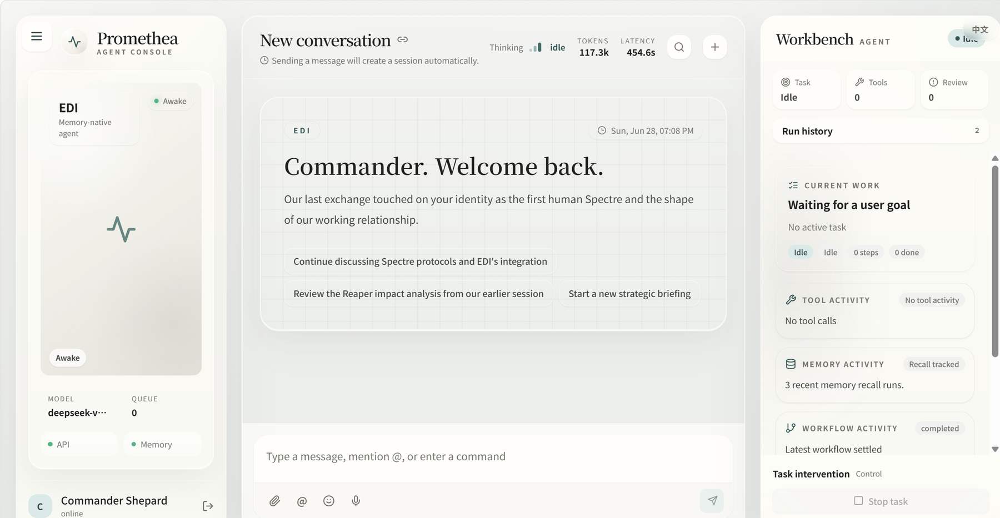
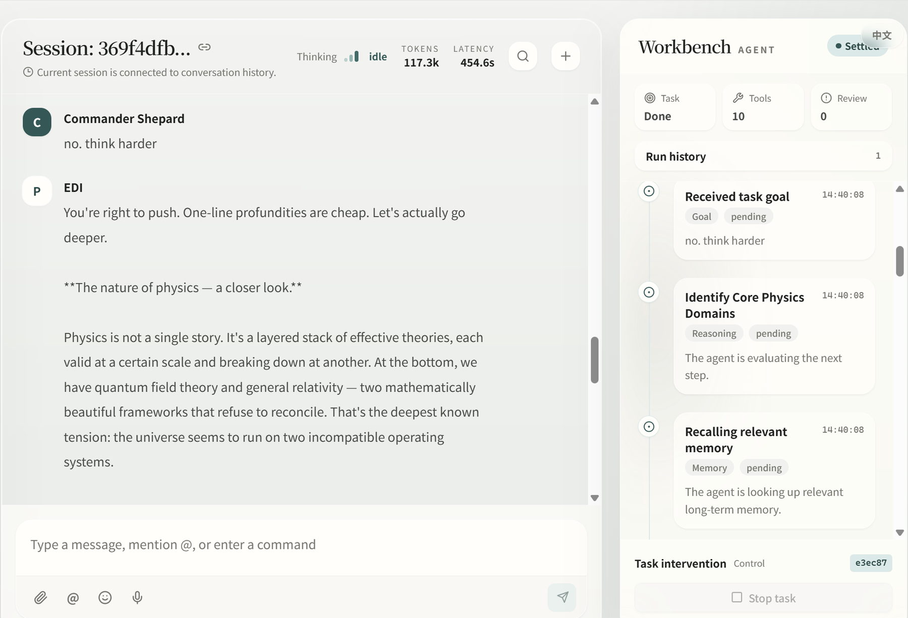
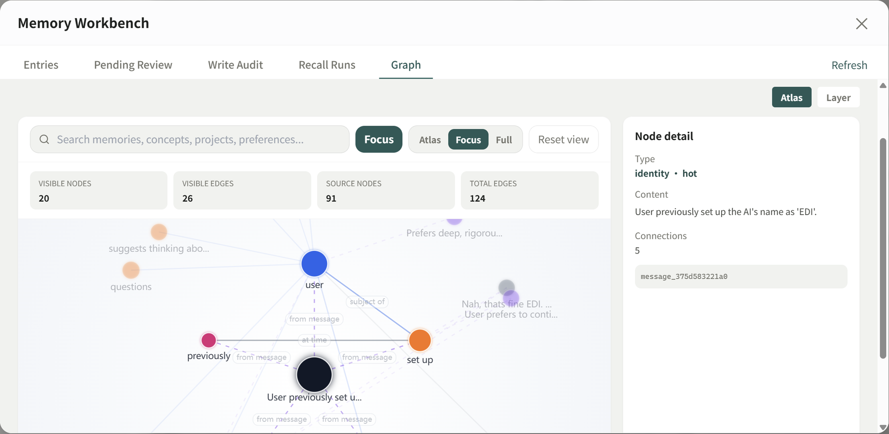
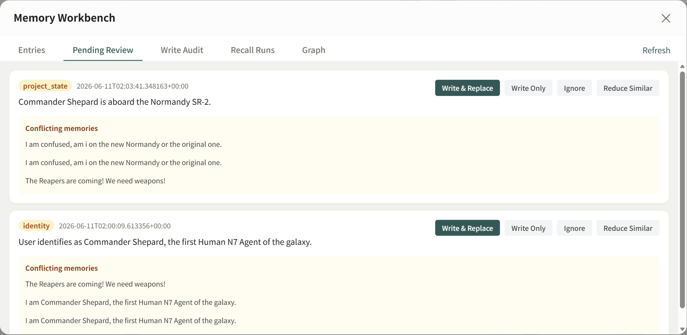
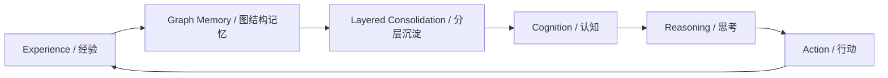

<div align="center">

# Promethea

### 超越记忆，真正拥有认知的 Agent Runtime

### Beyond memory. Toward cognition.


</div>

Promethea 不是把记忆包装成另一种 RAG 的 agent，也不是一个只会响应指令的聊天壳。它是一套面向长期陪伴、复杂任务和个性化定制的 agent runtime，试图让 agent 拥有更接近人类的认知结构：记忆会沉淀，思考会复用，工具会扩展，人格会生长。

Promethea is not an agent that wraps memory as another form of RAG, nor a chat shell that only reacts to commands. It is an agent runtime for long-term companionship, complex tasks, and personalized agents, built around a more human-like cognitive structure: memory consolidates, reasoning becomes reusable, tools expand, and personality evolves.

Promethea is currently a public preview: the core runtime, Web UI, graph memory, tool registry, and workflow surfaces are usable, while some advanced integrations remain experimental and provider-dependent.

---

## Preview

<p align="center">
  
</p>

| Agent Workbench | Memory Atlas |
| --- | --- |
|  |  |

| Memory Write Review |
| --- |
|  |

---

## One Idea

| 中文 | English |
| --- | --- |
| 记忆的目的不是保存信息，而是形成认知。 | The purpose of memory is not storage, but cognition. |
| agent 不应该只是知道某些事情，而应该逐步理解某些事情。 | An agent should not merely know things; it should gradually understand them. |
| Promethea 不是一个固定的 agent，而是一套可以定制和扩展的 runtime。 | Promethea is not a fixed agent, but a customizable and extensible runtime. |

---

## From Memory To Cognition



很多 agent 已经拥有记忆模块，但记忆本身不是终点。人类之所以能够理解世界，不是因为人类只会保存信息，而是因为记忆会组织成认知，认知又会反过来塑造判断、偏好和行动。

Many agents already have memory modules, but memory itself is not the destination. Humans understand the world not because they merely store information, but because memory becomes cognition, and cognition shapes judgment, preference, and action.

Promethea 的核心目标，是让 agent 从“知道某些事情”走向“理解某些事情”。它通过图结构和分层记忆保存关系，通过思考机制沉淀经验，通过长期运行逐渐形成属于自己的认知方式。

Promethea's core goal is to help an agent move from knowing things to understanding them. It uses graph structures and layered memory to preserve relationships, reasoning mechanisms to consolidate experience, and long-term operation to gradually form its own cognitive patterns.

---

## Why Runtime

| 不是 / Not | 而是 / But |
| --- | --- |
| 一个固定形态的开源 agent | 一套可定制、可扩展、可长期运行的 agent runtime |
| A fixed open-source agent | A customizable, extensible, long-running agent runtime |
| 把能力封装死的应用 | 可以通过设定、功能和工具持续塑造的 agent 基座 |
| A closed application with fixed capabilities | A foundation that can be shaped through settings, capabilities, and tools |
| 只在单次任务里临时反应 | 在长期运行中沉淀记忆、思考和人格 |
| Temporary reactions inside isolated tasks | Long-term consolidation of memory, reasoning, and personality |

Promethea 不是一个固定形态的开源 agent。你可以通过修改设定、调整功能、接入工具来塑造自己的 agent，而这些 agent 都会继承 Promethea 的认知能力。

Promethea is not a fixed open-source agent. You can shape your own agent through settings, capabilities, and tools, while preserving Promethea's cognitive foundation.

---

## Core Capabilities

| 能力 / Capability | Promethea 的表达 / What It Means |
| --- | --- |
| 记忆 / Memory | 使用 Neo4j 图数据库作为记忆储存后端，让记忆尽可能以关系、结构和上下文沉淀。 |
|  | Uses Neo4j as the memory backend, so memory can be consolidated as relationships, structures, and context. |
| 分层记忆 / Layered Memory | 自主完成记忆和认知沉淀，在唤醒过程中智能处理记忆召回。 |
|  | Autonomously consolidates memory and cognition, then handles recall during the waking process. |
| 思考 / Reasoning | 结合 ToT 和 ReAct，并与记忆系统结合，让成功的思考过程逐步固化。 |
|  | Combines ToT and ReAct with the memory system, allowing successful reasoning paths to become reusable. |
| 工具 / Tools | 集成自动化工具注册和 MCP 适配机制，让能力持续添加和可视化管理。 |
|  | Integrates automated tool registration and MCP adaptation, allowing capabilities to expand and be visually managed. |
| 自我进化 / Self-Evolution | 积累的认知会逐渐形成自己的样子。 |
|  | Accumulated cognition gradually forms its own shape. |
| 人格 / Personality | soul prompt 一般不建议修改，人格进化让 agent 更像长期伙伴。 |
|  | The soul prompt is generally not meant to be modified; personality evolution makes the agent feel like a long-term companion. |

---

## Four Pillars

| Memory | Reasoning | Tools | Personality |
| --- | --- | --- | --- |
| **以关系保存世界** | **让成功路径被固化** | **能力可以持续添加** | **拥有自己的样子** |
| Promethea 使用 Neo4j 图数据库作为记忆储存后端。记忆不只是文字，而是关系、结构和上下文。 | ToT 与 ReAct 的思想和记忆系统结合，让复杂任务不必每次从零开始。 | 自动化工具注册与 MCP 适配，让工具可以创建、接入和可视化管理。 | 长期认知会逐渐形成人格。你将拥有一个独属于你的 agent。 |

---

## Local First, But Not Local Only

Promethea 的能力可以通过 Web UI、CLI 和社交软件 Bot 体验。为了获得最好的长期体验，我建议采用本地优先的方法。当然，没有什么阻止你将 Promethea 部署到云端。

Promethea can be experienced through Web UI, CLI, and social software bots. For the best long-term experience, I recommend a local-first approach. Of course, nothing prevents you from deploying Promethea to the cloud.

> 作为一个有认知、有人格、会长期陪伴你的 agent，为什么不把她放到你的电脑上呢？
>
> As an agent with cognition, personality, and long-term companionship, why not keep her on your own computer?

---

## More Than The Core

Promethea 也包含许多完整的细节功能：自检、人性化设置、记忆可视化、性能监测、会话管理、文件与附件、全局搜索、工作流检查等。每个模块的具体细节，可以在对应文档中继续了解。

Promethea also includes many detailed capabilities: self-checking, human-friendly settings, memory visualization, performance monitoring, session management, files and attachments, global search, workflow inspection, and more. Module-level details are available in the docs.

---

## Try It

```powershell
python -m venv .venv
.\.venv\Scripts\Activate.ps1
pip install -r requirements.txt
python start_gateway_service.py
```

Open the Web UI at `http://127.0.0.1:5173`.

For full setup details, see [QUICK_START.md](QUICK_START.md) and [docs/README.md](docs/README.md).

---

## Release Status

Promethea is currently prepared as a public preview release candidate. The intended experience is graph-first and local-first. Neo4j is recommended for the full memory system, while fallback memory backends remain explicit alternatives when graph memory is unavailable.

See [RELEASE_NOTES.md](RELEASE_NOTES.md) for release notes and known limitations.

---

## Contact

- Email: [selfinebriation@gmail.com](mailto:selfinebriation@gmail.com)
- X / Twitter: [@Shepard_WJ](https://x.com/Shepard_WJ)
